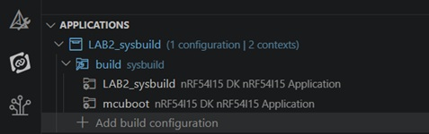

# Lab 2 - SYSBUILD

# Overview
In this lab, you will explore Sysbuild, Zephyr's multi-image build system, by extending the standard __hello_world__ sample to include MCUboot as a bootloader.

You will create a build configuration in Visual Studio Code using the nRF Connect for VS Code extension, build the project, and examine how Sysbuild organizes the generated build artifacts for each image.

By the end of this exercise, you will understand how Sysbuild coordinates multiple applications and where the generated output for each image can be found.

## ▶️ Step 1 - Copy Zephyr's _hello_world_ sample

   > 💡 __Tip:__ Instead of manually copying the __hello world__ project using File Explorer, you can also use the __Create a new application__ -> __Copy a sample__ feature in the __nRF Connect__ view.  
   
1) Create a new folder for your lab exercises.

   For example:  C:\Nordic\lab\

   or on Linux/macOS:  ~/lab/
   
2) Locate the __hello world__ sample in your nRF Connect SDK installation: _install-path_/zephyr/samples/hello_world
3) Copy the entire __hello_world__ directory into your lab workspace. Rename the __hello_world__ project folder to: __LAB2_sysbuild__

    Your workspace should now contain a structure similar to:

   ```
   ├─── Nordic
   │   ├─── lab
   │   │   ├─── LAB2_sysbuild
   ```

## ▶️ Step 2 - Open Project in VS Code
4) Open __Visual Studio Code__.
5) From the __nRF Connect__ extension, select __Open an existing application__.
6) Browse to the copied _hello_world_ / **LAB2_sysbuild** folder in your lab workspace and open it.
   > 💡 __Tip:__ Make sure you open the copied project, not the original sample located inside the SDK installation.

## ▶️ Step 3 - Include _MCUboot_ in the multi-image build
7) Add a new file __sysbuild.conf__ to your project folder and add following line in this file:

   ``` kconfig
   SB_CONFIG_BOOTLOADER_MCUBOOT=y
   ```

## ▶️ Step 4 - _Add Build Configuration_ to your project and build the project
8) Ensure you are in the __nRF Connect__ extension view.
9) In the __Applications__ chapter click within the added project on __Add build configuration__.
10) Use following settings for the _build configuration_:
    - __Board target__: nrf54l15dk/nrf54l15/cpuapp
    - __System build (sysbuild)__: Use sysbuild
11) Finally, click on the __Generate and Build__ button.

## ▶️ Step 5 - Explore the Build Directory
12) In the __nRF Connect__/__Applications__ view, expand the build directory.

    You should observe a structure similar to:
 
    

    Examine each folder.

## ▶️ Step 6 -  Changing MCUboot's Kconfig

> 💡 MCUboot is offered as a solution that can be configured using Kconfig and DeviceTree. In this example, we will customize the MCUboot Kconfig definition from our own project. 

13) When a reset is performed on the nrf54l15dk, we see in the Serial Terminal log that MCUboot runs first and outputs a boot banner along with debug information. Since MCUboot recognizes the "Hello World" firmware as correctly signed, it is executed. Here, we see another boot banner, followed by the output of the "Hello World" project.

   Check to see if the following boot banner appears in the Serial Terminal.
   
   ```
   *** Booting MCUboot v2.3.0-dev-c1d2d128a001 ***
   *** Using nRF Connect SDK v3.4.0-99553055607b ***
   *** Using Zephyr OS v4.4.0-bf801e4e3d19 ***
   ```
14) Let's disable the MCUboot boot banner. Create the following file in the specified directory:

    C:/Nordic/lab/LAB2_sysbuild/__sysbuild/mcuboot.conf__

    And add following Kconfig setting to this __mcuboot.conf__ file:

    ``` kconfig
    CONFIG_MCUBOOT_BOOT_BANNER=n
    CONFIG_NCS_BOOT_BANNER=n
    CONFIG_BOOT_BANNER=n
    ```

15) Build and flash the project. Then check the Serial Terminal output. 
