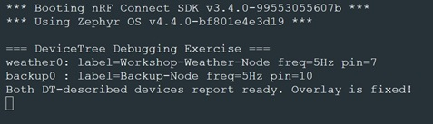

# Lab 4 - DeviceTree

## Overview
DeviceTree is one of the core concepts in Zephyr and the nRF Connect SDK. It provides a hardware description that allows applications and drivers to be portable across different boards without changing source code.

In this workshop, participants will explore how Zephyr assembles the final DeviceTree during the build process, learn how to customize hardware descriptions using overlays and custom bindings, and develop a systematic approach to debugging common DeviceTree issues.


## Exercise 1 - Explore: Reading a Real DeviceTree
### ▶️ Step 1 - Download, Add project to VS code, and Build the workshop application
1) Download the lab project from [here](../Lab_Files/LAB4_DerviceTree/dt_workshop_app)
2)  Add this project with __Open an existing application__ to VS code.
3) __Add build configuration__ and use following configuration:
   - __Board Target__: nrf54l15dk/nrf54l15/cpuapp
4) __Generate and Build__ the project.
5) __Flash__ the project. Open Serial Terminal and ovserve the boot log.

### ▶️ Step 2 -  Explore generated DeviceTree 
6) Open __build/dt_workshop_app/zephyr/zephyr.dts__.
   - Search for <code>led0</code> => What is the DeviceTree Node path? Which GPIO is used for LED0?
   - Search for <code>button0</code> => What is the DeviceTree node path? Which GPIO is used for Button0?

7) Search for <code>uart20</code> and verify the configured baud rate (<code>current-speed</code>) and node status. 

   > 💡 __Tip:__ This is the DK's console UART (chosen zephyr,console).

8) Open __build/dt_workshop_app/zephyr/include/generated/zephyr/devicetree_generated.h__
  
   Search for the GPIO pin associated with one of the LEDs (e.g. search "led_0" and find your LED's ordinal, take a look on the following "led_0" definitions) and ovserve how DeviceTree information has been converted into generated macro.

   > 💡 This is what DT_ macros expand to at compile time - there is no runtime devicetree parsing in Zephyr.

   > 💡 Zephyr's DT_ macro APIs such as <code>DT_NODELABEL</code>, <code>DT_ALIAS</code>, <code>DT_PROP</code>, <code>GPIO_DT_SPEC_GET</code>, ... are wrappers around these generated macros.

### ▶️ Step 3 - Match the code to the tree
9) Open __dt_workshop_app/src/main.c__. For each <code>DT_ALIAS</code> and <code>DT_NODELABEL</code> macro:
   - Identify the corresponding node in zephyr.dts.
   - Explain which DeviceTree node it resolves to.
   - Verify that the serial output matches the DeviceTree configuration.

### ▶️ Step 4 - Bonus: Visual Tools
-	In VS Code with the nRF Connect extension, hover over a node or property in an overlay file to see live binding documentation.
-	Use __DeviceTree Visual Editor__ and check LED and button pins. 


## Exercise 2 – Extend: Overlays and Custom Bindings

### ▶️ Step 5 -  Explore the overlay
10) Open __dt_workshop_app/boards/nrf54l15dk_nrf54l15_cpuapp.overlay__

   Observe that it:
   - creates the alias <code>my-led</code>
   - adds the custom node <code>fake_sensor0</code>

### ▶️ Step 6 -  Inspect the custom binding
11) Open __dt_workshop_app/dts/bindings/sensor/workshop,fake-sensor.yaml__

    Review the defined properties and their validation rules.

   > 💡 Zephyr automatically searches __<app>/dts/bindings__ for bindings, no extra CMake configuration required.
   >
   > Note the three properties:
   > - <code>sensor-label</code> (required string),
   > - <code>sampling-frequency-hz</code> (int, default 10), and
   > - <code>io-gpios</code> (a phandle-array, the same property "type" used by real GPIO-based drivers).

### ▶️ Step 7 -  Verify 
12) In __build/dt_workshop_app/zephyr/zephyr.dts__, find <code>fake-sensor@0</code> and confirm your properties are present.
13) Verify the serial output displays:
	- the <code>my-led</code> alias
    - the sensor-label
    - the sample frequency

### ▶️ Step 8 -  Modify the configuration
14) Change the value of <code>sampling-frequency-hz</code>

    Rebuild and verify that the updated value appears in the serial output without modifying the appliation source code.
    
16) Add a second alias:

   ```
   my-button = &button0;
   ```
   
   Update __main.c__ to print the alias using: 

   ``` c
   DT_ALIAS(my_button)
   ```
   
17) Temporarily delete the <code>sensor-label</code> line from the overlay and rebuild.

    Read the error message. It should point you straight at the missing required property - this is edtlib enforcing your binding's <code>required: true</code>. Put the line back before continuing.

    > 💡 Edtlib (edtlib.py) is a Python library used to parse and interpret hardware DeviceTrees by combining DeviceTree source files with YAML binding files. It provides a higher-level view of system hardware elements like buses and interrupts, and is widely used in the Zephyr RTOS build system
 	

## Exercise 3 - Debug: Fixing a Broken DeviceTree

### ▶️ Step 9 - Open new project
18) Download the lab project from [here](../Lab_Files/LAB4_DeviceTree/dt_debug_exercise)
19) Add the project to VS Code. __Add build configuration__ with board target nrf54l15dk/nrf54l15/cpuapp.

### ▶️ Step 10 - Build and Fix Issues
20) Read the first error message end-to-end before touching anything. It will reference boards/nrf54l15dk_nrf54l15_cpuapp.overlay.
21) Fix only that one problem, then rebuild.
22) Repeat the process until all DeviceTree errors have been resolved.

    > 💡 __Tip:__ During this process, expect to encounter:
    > - an undefined DeviceTree label
    > - a property with an incorrect type
    > - an incompatible compatible string

23) Once the build succeeds, flash and check the serial log for: "Both DT-described devices report ready!". If you see it, your fixes are correct - a clean build alone does not guarantee that.

	The log in the Serial Terminal should look like this:

   
   
   > 💡 Stuck for more than ~10 minutes? Compare against solution/nrf54l15dk_nrf54l15_cpuapp.overlay in the same project, and read the comments at the top of that file for the explanation of each fix.


   
